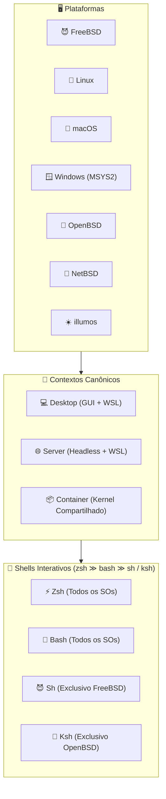
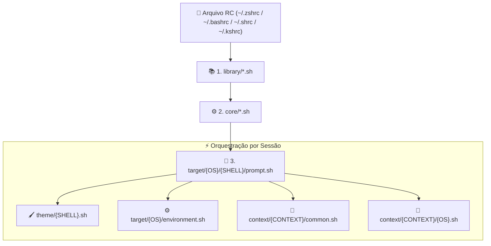

# 🐚 Universal Shell Environment

> Configurações, aliases e prompts centralizados para todos os seus ambientes de sistema, mantendo a experiência consistente seja no Desktop, Servidor, Contêiner ou WSL. Componente de runtime interativo do **Quarteto de Produtividade**, construído sobre o **Triângulo Dourado de Engenharia: o equilíbrio perfeito entre Estabilidade inabalável, Eficiência extrema (< 20ms) e Conveniência ergonômica**.

---

### 🏛️ O Quarteto de Produtividade

[](https://github.com/GabrielFrigo4/setup)
[](https://github.com/GabrielFrigo4/shell)
[](https://github.com/GabrielFrigo4/vault)
[](https://github.com/GabrielFrigo4/profile)

> 📖 **Arquitetura Unificada do Ecossistema:** Conheça a matriz completa de responsabilidades, ciclo de boot e segregação de privilégios em [ENVIRONMENT.md](ENVIRONMENT.md).
> 📜 **Princípios de Engenharia:** Conheça os 18 princípios UNIX e boas práticas Clean Code em [PRINCIPLES.md](PRINCIPLES.md).

---

### 🖥️ Sistemas, Contextos & Shells

[](https://github.com/GabrielFrigo4/shell/actions/workflows/ci.yml)

**Plataformas Homologadas:**<br>


-Supported-purple?logo=gitforwindows&logoColor=white>)


**Shells Suportados (`zsh` ≫ `bash` ≫ `sh` / `ksh`):**<br>


**Shells Incompatíveis (Descartados):**<br>




#### 🐚 Matriz de Suporte a Shells

| Shell             |    Status     | Detalhes & Decisão de Arquitetura                                                                                                                                        |
| :---------------- | :-----------: | :----------------------------------------------------------------------------------------------------------------------------------------------------------------------- |
| **Zsh (`zsh`)**   |    🟢 100%    | Shell primário interativo moderno. Autocompletion interativo com Tab e setas (`menu select`), case-insensitive e histórico estendido. Suportado em todas as plataformas. |
| **Bash (`bash`)** |    🟢 100%    | Suporte universal nativo em Linux, macOS, BSDs, illumos e Windows. Readline completion interativo, histórico atômico sincronizado e busca por prefixo.                   |
| **Sh (`sh`)**     |    🟢 100%    | Shell POSIX fundamental (**exclusivo do FreeBSD `/bin/sh`**). Mini prompt gráfico calibrado (128B/192B), histórico `libedit` completo e fallback TTY puro.               |
| **Ksh (`ksh`)**   |    🟢 100%    | Shell nativo clássico (**exclusivo do OpenBSD `/bin/ksh`**). Prompt adaptativo dinâmico, histórico in-memory, bindings Emacs e zero overhead.                            |
| **Dash (`dash`)** | ❌ Descartado | **Incompatibilidade POSIX:** BNF estrita proíbe nomes `kebab-case` (`-`) em funções (`update-all`, etc.). Auto-elevação para `zsh`/`bash` no instalador.                 |
| **Fish (`fish`)** | ❌ Descartado | **Incompatibilidade POSIX:** Sintaxe própria incompatível com `source` em arquivos `.sh` e `export`.                                                                     |

> 💡 **O Caso do FreeBSD `/bin/sh` & Engenharia Cirúrgica de Prompt:**
> O `/bin/sh` do FreeBSD opera sobre a biblioteca `libedit` e possui um buffer estático em C (`#define PROMPTLEN 192` em FreeBSD 14+ e `128` em <= 13 em `bin/sh/parser.c`), sem `malloc` dinâmico para garantir estabilidade no modo monousuário. O parser em C converte `\[` e `\]` para `\001` (1B) e `\e` para `0x1b` (1B), tornando a ocupação real em C menor do que a contagem bruta de caracteres da string. O motor dinâmico em `theme/sh.sh` calibra com precisão cirúrgica de bytes dois layouts: **`pill`** (192B) e **`micro`** (128B com fallback automático), aproveitando até 98% do buffer físico com texto útil (pastas e branches completas) sem estouro de memória. Detalhes completos em [docs/THEMES.md](docs/THEMES.md).

---

## 🚀 Instalação Rápida

O instalador é **multi-shell automático**: ao ser executado, ele detecta os shells suportados instalados na máquina e configura todos eles em lote:

- **FreeBSD:** configura automaticamente `zsh`, `bash` e `sh` (caso instalados).
- **OpenBSD:** configura automaticamente `zsh`, `bash` e `ksh` (caso instalados).
- **Linux:** configura automaticamente `zsh` e `bash` (caso instalados).
- **macOS:** configura automaticamente `zsh` e `bash` (caso instalados).
- **Windows (MSYS2):** configura `zsh` e `bash` (caso instalados).
- **NetBSD:** configura automaticamente `zsh` e `bash` (caso instalados).
- **illumos:** configura automaticamente `zsh` e `bash` (caso instalados).

> 💡 **Novo shell instalado depois?** Se você instalar um novo shell posteriormente (ex: `sudo pacman -S zsh` ou `pkg install zsh`), basta executar `reinstall-shell` (ou reexecutar o `install.sh`) e ele configurará o novo shell automaticamente!

### 🐧 Linux / 😈 FreeBSD / 🍎 macOS

```sh
sudo git clone "https://github.com/GabrielFrigo4/shell" "/usr/local/share/shell"
sh "/usr/local/share/shell/install.sh" --context desktop
```

### 🪟 Windows (MSYS2)

```sh
git clone "https://github.com/GabrielFrigo4/shell" "${HOME}/.shell"
sh "${HOME}/.shell/install.sh" --context desktop
```

### ⚙️ Opções do Instalador

| Opção         |      Atalho      | Valores                           |   Padrão   | Descrição                                                                    |
| :------------ | :--------------: | :-------------------------------- | :--------: | :--------------------------------------------------------------------------- |
| `--context`   |       `-c`       | `desktop`, `server`, `container`  | `desktop`  | Perfil de contexto do ambiente.                                              |
| `--shell`     |       `-s`       | `all`, `zsh`, `bash`, `sh`, `ksh` |   `all`    | Instala em todos os shells instalados ou em um alvo específico.              |
| `--framework` | `--oh-my-shell`  | Flag booleana                     | Desativado | Habilita frameworks externos de terceiros (Oh-My-Zsh / Oh-My-Bash).          |
| `--pure`      | `--no-framework` | Flag booleana                     |  Ativado   | Modo padrão: templates standalone nativos, zero overhead e boot instantâneo. |

---

## ⚡ Comandos Mais Usados

| Comando / Alias                       | Ação                                                                                                            | Destino               |
| :------------------------------------ | :-------------------------------------------------------------------------------------------------------------- | :-------------------- |
| `update-all` / `upall` / `u`          | **Orquestrador Global:** Atualiza SO + AUR + Flatpak + Snap + MAS.                                              | Universal             |
| `update-system` / `upsys`             | Atualiza pacotes do sistema operacional nativo.                                                                 | Universal             |
| `update-shell` / `upsh`               | Atualiza o repositório ativo do shell (`$SHELL_REPO_DIR` ou `/usr/local/share/shell`), limpa cache e recarrega. | Universal             |
| `update-editors` / `uped`             | Atualiza as configurações residentes ativas dos editores (`~/.emacs.d`, `~/.config/nvim`, etc.).                | Universal             |
| `update-profile` / `uprc`             | Atualiza o repositório do profile (`~/.config/profile`), reaplica dotfiles/skills e recarrega `~/.profile`.     | Universal             |
| `reinstall-shell` / `resh`            | Reexecuta o instalador em todos os shells instalados no SO.                                                     | Universal             |
| `clean-cache` / `ccache`              | Limpa o cache em memória e tmpfs de todos os detectores do ambiente.                                            | Universal             |
| `update-vault` / `upvt`               | Sincroniza segredos (`~/.vault`) e recarrega chaves SSH.                                                        | Universal             |
| `bench-shell` / `bsh` / `shell-bench` | Mede a latência de inicialização dos shells e módulos isolados.                                                 | Universal             |
| `update-wifi` / `upwf`                | Sincroniza credenciais Wi-Fi configuradas com o SO.                                                             | Linux, BSD, Windows   |
| `update-network` / `upnet`            | Valida conectividade e sincroniza credenciais de rede.                                                          | Universal             |
| `editor [alvo]` / `e`                 | Abre o editor padrão configurado na cascata de prioridade.                                                      | `$VISUAL` / `$EDITOR` |
| `open-neovim` / `on`                  | Abre o Neovim no alvo especificado (padrão: `.`).                                                               | `nvim`                |
| `open-helix` / `oh` / `h`             | Abre o Helix no alvo especificado (padrão: `.`).                                                                | `hx`                  |
| `open-code` / `oc`                    | Abre o VS Code no alvo especificado (padrão: `.`).                                                              | `code` / `vscode`     |
| `mount-device` / `mntdev` / `mdev`    | Monta celular em `~/Device` via GVfs/KIO-FUSE/GSConnect/ADB.                                                    | Desktop               |
| `umount-device` / `umdev` / `udev`    | Desmonta e desconecta `~/Device` com segurança.                                                                 | Desktop               |
| `ports` / `p`                         | Inspeciona portas de rede em escuta (`ss` > `netstat` > `sockstat`)                                             | Servidor / Desktop    |
| `services` / `svc`                    | Inspeciona status dos serviços (`systemctl` > `service` > `rc-status`)                                          | Servidor / Desktop    |
| `l`, `ll`, `la`, `lt`                 | Listagem moderna com ícones e status git (`eza`/`exa`/`ls`).                                                    | Universal             |
| `g <termo>`                           | Busca inteligente de texto em arquivos (`rg` > `grep`).                                                         | Universal             |
| `c <arquivo>` / `b`                   | Visualizador formatado com syntax highlighting (`bat` > `cat`).                                                 | Universal             |
| `f <alvo>` / `ff`                     | Localizador ultrarrápido de arquivos (`fd` > `find`).                                                           | Universal             |

> 📖 **Consulte o catálogo completo de atalhos e variáveis em [docs/ALIASES.md](docs/ALIASES.md).**

---

## 📚 Documentação Técnica Completa

Para aprofundar na arquitetura, comportamentos por contexto e motores de detecção:

- 🏛️ **[docs/ARCHITECTURE.md](docs/ARCHITECTURE.md)**: Ciclo de vida da sessão interativa, cascata de sourcing e orçamento de latência (&lt; 64ms).
- 🎯 **[docs/CONTEXTS.md](docs/CONTEXTS.md)**: Especificação dos perfis `desktop`, `server` e `container` (com auto-detecção WSL).
- 🧠 **[docs/DETECTION.md](docs/DETECTION.md)**: Reconhecimento de SOs, famílias de distros Linux, dark mode (D-Bus/XDG Portal) e integração GTK/Qt/Electron.
- 🖌️ **[docs/THEMES.md](docs/THEMES.md)**: Contratos visuais dos prompts (Zsh, Bash, Sh), paleta ANSI e fallback para TTYs puros.
- 🗺️ **[docs/ALIASES.md](docs/ALIASES.md)**: Dicionário exaustivo de comandos públicos, atalhos e variáveis de ambiente.

---

## 📁 Estrutura do Repositório



- 🐚 **`shell.sh`**: Interface unificada de componente e entrypoint de runtime (CLI & source reentrante).
- 📚 **[library/](library/README.md)**: Biblioteca padrão com utilitários POSIX (`functions.sh`), sistema de emissão semântica (`ui.sh`) e módulos analíticos (`detect.sh`).
- ⚙️ **[core/](core/README.md)**: Fundações do ambiente (`environment.sh`) e integração com segredos (`vault.sh`).
- 🎯 **[context/](context/README.md)**: Orquestrador de perfis operacionais (`desktop`, `server`, `container`).
- 🖌️ **[theme/](theme/README.md)**: Motores de renderização de prompts (Zsh, Bash, Sh, Ksh).
- 🎨 **`target/`**: Configurações específicas por sistema operacional (`Linux`, `FreeBSD`, `OpenBSD`, `NetBSD`, `illumos`, `macOS`, `Windows`).

---

## 🧪 Quality Gates & Ganchos Git (.githooks)

Para habilitar a validação multi-shell, benchmark de latência e verificação de Markdown antes de cada commit:

```sh
chmod 0755 .githooks/pre-commit
git config core.hooksPath .githooks
```

Para executar o pre-commit hook manualmente:

```sh
./.githooks/pre-commit
```
