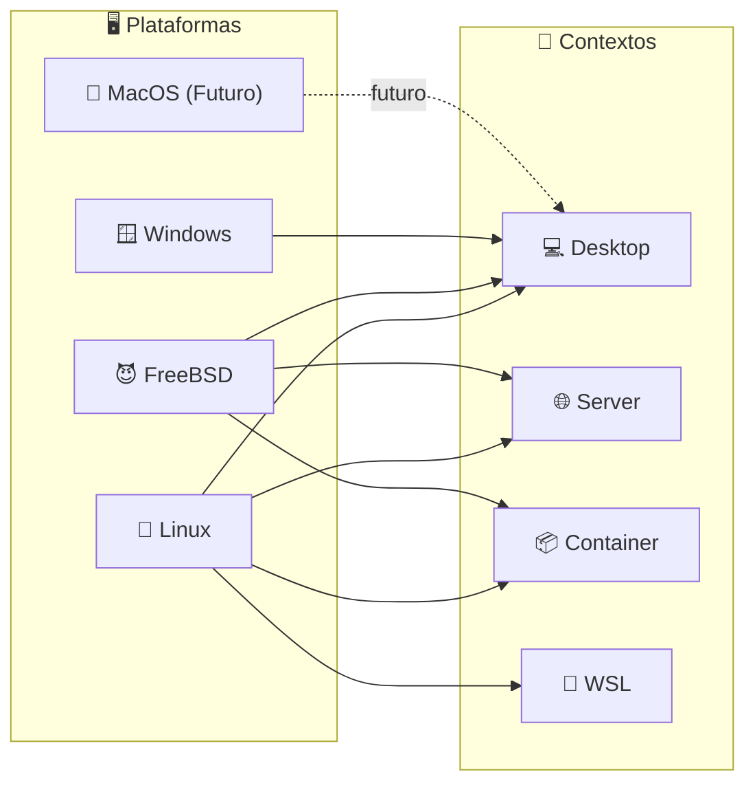
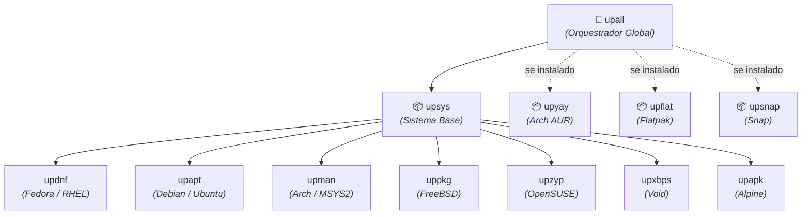
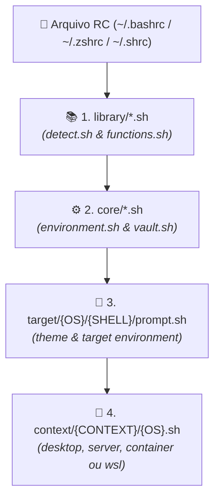

# 🐚 Universal Shell Environment

> Configurações, aliases e prompts centralizados para todos os seus ambientes de sistema, mantendo a experiência consistente seja no Desktop, Servidor, Contêiner ou WSL.

### Sistemas Suportados


### Contextos de Ambiente




### Shells Compatíveis


## 🚀 Instalação

Você pode escolher o contexto do ambiente passando o parâmetro `--context` (opções: `desktop`, `server`, `container`, `wsl`).
Por padrão, se não for informado, o script assumirá o contexto `desktop`.

### 🐧 Linux / 😈 FreeBSD / 🍎 MacOS

**1. Clone o repositório:**

```sh
sudo git clone "https://github.com/GabrielFrigo4/Shell" "/usr/local/share/shell"
```

**2. Execute a instalação:**
_Escolha o contexto desejado abaixo e copie o comando do seu shell de preferência:_

**💻 Desktop (Padrão)**

```sh
bash "/usr/local/share/shell/install.sh" --context desktop
# ou
zsh "/usr/local/share/shell/install.sh" --context desktop
# ou
sh "/usr/local/share/shell/install.sh" --context desktop
```

**🌐 Server**

```sh
bash "/usr/local/share/shell/install.sh" --context server
# ou
zsh "/usr/local/share/shell/install.sh" --context server
# ou
sh "/usr/local/share/shell/install.sh" --context server
```

**📦 Container**

```sh
bash "/usr/local/share/shell/install.sh" --context container
# ou
zsh "/usr/local/share/shell/install.sh" --context container
# ou
sh "/usr/local/share/shell/install.sh" --context container
```

**🧩 WSL**

```sh
bash "/usr/local/share/shell/install.sh" --context wsl
# ou
zsh "/usr/local/share/shell/install.sh" --context wsl
# ou
sh "/usr/local/share/shell/install.sh" --context wsl
```

### 🪟 Windows

> 💡 **Ambiente:** No Windows, o projeto funciona utilizando o terminal do **MSYS2**.

**1. Clone o repositório:**

```sh
git clone "https://github.com/GabrielFrigo4/Shell" "${HOME}/.shell"
```

**2. Execute a instalação:**

```sh
bash "${HOME}/.shell/install.sh" --context desktop
# ou
zsh "${HOME}/.shell/install.sh" --context desktop
```

### 🔄 Pós-Instalação

Reinicie o shell ou recarregue o arquivo `RC` manualmente:

```sh
. ~/.bashrc
# ou
. ~/.zshrc
# ou
. ~/.shrc
```

> 💡 **Nota Importante:** O script detecta automaticamente o seu OS, distribuição 🐧 `Linux` e qual 🐚 `Shell` está rodando, e injeta as linhas de `source` no arquivo RC correto de forma inteligente — tanto para o seu usuário atual como para o `root`.

## 🛠️ Gerenciamento do Ambiente

O projeto inclui aliases e funções inteligentes integrados para que você possa manter seu ambiente atualizado, gerenciado e controlado sem esforço, diretamente do terminal:

- 🔄 **`upsh` (Update Shell):** Sincroniza o seu repositório local (`git pull`) e recarrega as configurações atuais sem precisar fechar o terminal.
- ♻️ **`resh` (Reinstall Shell):** Vai além da atualização. Ele baixa as novidades e reexecuta o script `install.sh` preservando o seu contexto atual (ex: `desktop` ou `server`). Ideal para quando há mudanças estruturais profundas no repositório.
- 📡 **`upwf` (Update Wi-Fi):** Sincroniza automaticamente as credenciais de Wi-Fi definidas no ambiente (`WIFI_SSID_*` e `WIFI_PASS_*`) com o gerenciador nativo do sistema (`nmcli` no Linux, `wpa_supplicant` / `wifibox` no FreeBSD, ou `netsh` no Windows).
- 🌐 **`upnet` (Update Network):** Orquestra a inicialização e sincronização completa da rede chamando o `upwf`.
- 📦 **`upsys` (Update System):** Atualiza os pacotes e repositórios nativos do sistema operacional chamando dinamicamente o gerenciador nativo da distribuição (`upapt`, `upman`, `updnf`, `uppkg`, `upzyp`, `upxbps` ou `upapk`).
- 🚀 **`upall` (Update All):** Orquestrador universal de atualização completa. Executa o `upsys` e integra de forma encadeada todos os gerenciadores extras presentes no sistema (`upyay`, `upflat`, `upsnap`).
- ⚡ **`poweroff` & `reboot`:** Atalhos multiplataforma inteligentes que adaptam o comando de desligamento e reinicialização para o sistema correto:
  - 🐧 **Linux:** `sudo shutdown -h now` / `sudo shutdown -r now`
  - 😈 **FreeBSD:** `sudo shutdown -p now` / `sudo shutdown -r now` (utiliza `-p` para desligar a fonte de alimentação)
  - 🪟 **Windows (MSYS2):** `shutdown.exe /s /t 0` / `shutdown.exe /r /t 0`



## 🔐 Integração com Vault (Segredos Seguros)

Para manter este repositório 100% público e seguro, o sistema possui uma integração nativa com um repositório de cofre privado (Vault).

Se o diretório `~/.vault` for detectado, o shell carregará automaticamente:

- 🔑 **Variáveis e Configurações:** Credenciais, tokens, chaves de API, endereços de servidores e atalhos de conexão privados (`vault.sh`).
- 🛡️ **Chaves SSH:** O alias `vault-keys` detecta o seu `ssh-agent` rodando e adiciona automaticamente todas as suas chaves privadas contidas na pasta do cofre de forma segura e silenciosa.
- 🔄 **`upvt` (Update Vault):** Sincroniza o repositório do seu cofre (`git pull` em `~/.vault`) e recarrega o terminal com as novas variáveis e chaves atualizadas.

## 🧠 Detecção Inteligente

O projeto conta com módulos avançados de reconhecimento em `library/detect.sh` que mapeiam perfeitamente o seu ecossistema:

- **OS e Shell:** Reconhece se você está no 🐧 `Linux`, 😈 `FreeBSD`, 🍎 `MacOS` ou 🪟 `Windows` (via **MSYS2**), e identifica o 🐚 `Shell` rodando (📜 `bash`, ⚡ `zsh`, ⚙️ `sh`).
- **Distribuição Linux e Família:** Ao rodar no 🐧 `Linux` ou no 🧩 `WSL2`, o módulo descobre a distribuição exata (`detect_distro`) e a agrupa pela família do gerenciador de pacotes base (`detect_distro_family` — ex: `debian`, `arch`, `fedora`, `suse`, `void`, `alpine`).
  Isso permite que `upsys` e `upall` chamem os comandos corretos (`upapt`, `upman`, `updnf`, `uppkg`, etc.) automaticamente sob os panos, sem conflitos. Gerenciadores isolados como `flatpak`, `snap` e `yay` (AUR) ganham comandos modulares dedicados (`upflat`, `upsnap`, `upyay`) que são orquestrados dinamicamente pelo `upall`.

## 📁 Estrutura do Repositório



- 🎨 **`target/`**: Configurações divididas por Sistema Operacional (🐧 `Linux`, 😈 `FreeBSD`, 🍎 `MacOS`, 🪟 `Windows`). Mantém a experiência visual exata 1:1, independentemente de ser um pinguim, demônio ou janela.
- 📚 **`library/`**: A biblioteca padrão do projeto. Fornece o arsenal de ferramentas, utilitários de sistema e módulos de inteligência (como o rastreamento do SO), garantindo que operações complexas funcionem de forma limpa em qualquer plataforma POSIX.
- ⚙️ **`core/`**: O núcleo do projeto. Responsável por inicializar as fundações do ambiente, variáveis essenciais e integrações primárias (como o Vault), servindo de base estrutural para todos os outros módulos e contextos.
- 🎯 **`context/`**: O orquestrador de ambientes. Adapta dinamicamente o comportamento e as ferramentas do shell com base no seu escopo de uso atual, garantindo o fluxo de trabalho ideal para cada cenário:
  - 💻 **`desktop/`**: O ambiente de produtividade primário. Carregado com um conjunto rico de ferramentas, atalhos gráficos e otimizações de interface projetadas para maximizar a eficiência e o conforto no uso diário.
  - 🌐 **`server/`**: A fundação de alta performance. Um perfil extremamente enxuto, seguro e focado em estabilidade, projetado especificamente para servidores remotos e ambientes de produção onde agilidade é crucial.
  - 📦 **`container/`**: O perfil para microambientes. Derivado do contexto servidor, é rigorosamente otimizado para a execução em 📦 `Contêineres` (como `LXC`/`Incus` no 🐧 `Linux` ou `Jails`/`Bastille` no 😈 `FreeBSD`), garantindo o mínimo de sobrecarga computacional.
  - 🧩 **`wsl/`**: O ambiente híbrido de ponte. Une o melhor dos dois mundos, integrando o ecossistema 🐧 `Linux` do 🧩 `WSL2` de forma fluida com as ferramentas nativas do 🪟 `Windows` (interoperabilidade com Explorer, PowerShell, CMD e área de transferência).
- 🖌️ **`theme/`**: A camada de identidade visual. Responsável por unificar a estética do terminal, gerenciando o prompt, esquema de cores e integrações com frameworks (como Oh-My-Zsh e Oh-My-Bash) para garantir uma experiência consistente e premium.
