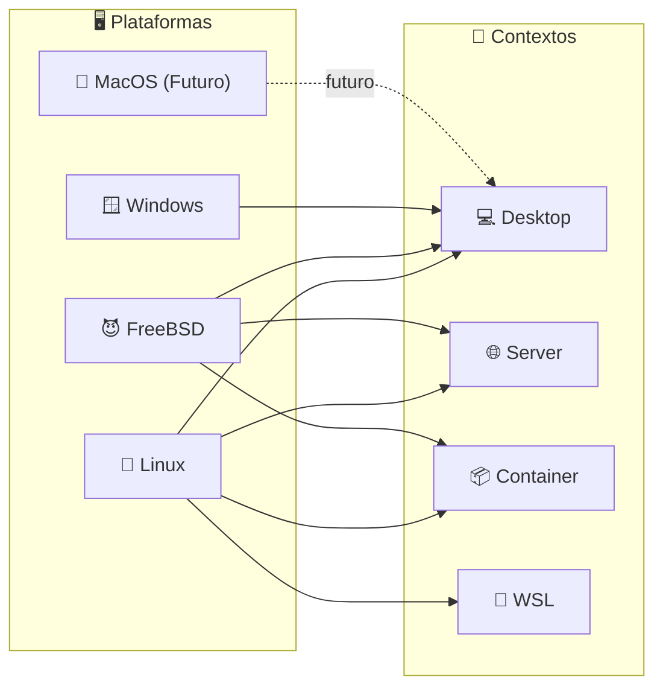
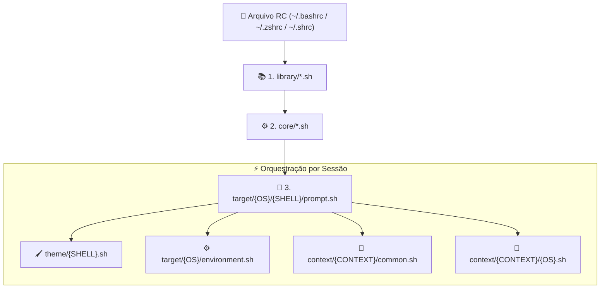

# 🐚 Universal Shell Environment

> Configurações, aliases e prompts centralizados para todos os seus ambientes de sistema, mantendo a experiência consistente seja no Desktop, Servidor, Contêiner ou WSL.

### Sistemas Suportados


### Contextos de Ambiente




### Shells Compatíveis


> 💤 **Nota sobre o Dash:** O shell `dash` permanece em estado dormente (delegando para o `sh`). Como o parser estrito do `dash` rejeita a declaração de funções em `kebab-case` (`path-front()`, `mount-device()`), optamos por não comprometer a arquitetura Clean Code do projeto por causa dele. Caso o `dash` implemente essa compatibilidade no futuro, o suporte florescerá!

> 📖 **Princípios de Engenharia:** Conheça os 18 princípios UNIX e boas práticas Clean Code aplicadas a este shell em [PRINCIPLES.md](PRINCIPLES.md).

## 🚀 Instalação

Você pode escolher o contexto do ambiente passando o parâmetro `--context` (opções: `desktop`, `server`, `container`, `wsl`).
Por padrão, se não for informado, o script assumirá o contexto `desktop`.

### 🐧 Linux / 😈 FreeBSD / 🍎 MacOS

**1. Clone o repositório:**

```sh
doas git clone "https://github.com/GabrielFrigo4/Shell" "/usr/local/share/shell"
# ou
sudo git clone "https://github.com/GabrielFrigo4/Shell" "/usr/local/share/shell"
```

**2. Execute a instalação:**
_Escolha o contexto desejado abaixo e copie o comando do seu shell de preferência:_

**💻 Desktop (Padrão)**

```sh
bash "/usr/local/share/shell/install.sh" --context desktop
# ou
zsh "/usr/local/share/shell/install.sh" --context desktop
# ou
sh "/usr/local/share/shell/install.sh" --context desktop
```

**🌐 Server**

```sh
bash "/usr/local/share/shell/install.sh" --context server
# ou
zsh "/usr/local/share/shell/install.sh" --context server
# ou
sh "/usr/local/share/shell/install.sh" --context server
```

**📦 Container**

```sh
bash "/usr/local/share/shell/install.sh" --context container
# ou
zsh "/usr/local/share/shell/install.sh" --context container
# ou
sh "/usr/local/share/shell/install.sh" --context container
```

**🧩 WSL**

```sh
bash "/usr/local/share/shell/install.sh" --context wsl
# ou
zsh "/usr/local/share/shell/install.sh" --context wsl
# ou
sh "/usr/local/share/shell/install.sh" --context wsl
```

### 🪟 Windows

> 💡 **Ambiente:** No Windows, o projeto funciona utilizando o terminal do **MSYS2**.

**1. Clone o repositório:**

```sh
git clone "https://github.com/GabrielFrigo4/Shell" "${HOME}/.shell"
```

**2. Execute a instalação:**

```sh
bash "${HOME}/.shell/install.sh" --context desktop
# ou
zsh "${HOME}/.shell/install.sh" --context desktop
```

### 🔄 Pós-Instalação

Reinicie o shell ou recarregue o arquivo `RC` manualmente:

```sh
. ~/.bashrc
# ou
. ~/.zshrc
# ou
. ~/.shrc
# ou
. ~/.dashrc
```

> 💡 **Nota Importante:** O script detecta automaticamente o seu OS, distribuição 🐧 `Linux` e qual 🐚 `Shell` está rodando, e injeta as linhas de `source` no arquivo RC correto de forma inteligente — tanto para o seu usuário atual como para o `root`.

## 🗺️ Mapa de Comandos Públicos & Atalhos

O projeto adota uma convenção estrita de nomenclatura para garantir máxima clareza e manter o seu autocompletion limpo:

- 🌐 **`kebab-case` (ou termo único) = Comandos Públicos:** Utilitários e atalhos desenhados para você usar interativamente no terminal.
- 🔒 **`_snake_case` (prefixo `_`) = Helpers Privados:** Funções internas de bootstrapping e infraestrutura que não poluem o autocompletion.

### 1. ⚙️ Shell, Ambiente & Vault (Universais)

| Comando / Alias    | Descrição                                                                                     | Compatibilidade       |
| :----------------- | :-------------------------------------------------------------------------------------------- | :-------------------- |
| `upsh`             | Sincroniza o repositório local do shell (`git pull`) e recarrega a sessão.                    | Universal             |
| `resh`             | Reexecuta o instalador `install.sh` preservando o contexto ativo (`desktop`, `server`, etc.). | Universal             |
| `upvt`             | Sincroniza o repositório do cofre (`~/.vault`) e recarrega chaves e variáveis.                | Linux, FreeBSD, macOS |
| `path-front <dir>` | Insere um diretório no início do `$PATH` (prioridade máxima).                                 | Universal             |
| `path-back <dir>`  | Insere um diretório no fim do `$PATH` (prioridade mínima).                                    | Universal             |
| `path-dedup`       | Remove diretórios duplicados do `$PATH` preservando a ordem.                                  | Universal             |

### 2. 📝 Editores de Texto & Terminal

| Comando / Alias                  | Descrição                                                              | Editor Alvo                                                                                           |
| :------------------------------- | :--------------------------------------------------------------------- | :---------------------------------------------------------------------------------------------------- |
| `editor [alvo]` / `e [alvo]`     | Abre o editor padrão configurado. Se chamado sem argumentos, abre `.`. | `$VISUAL` / `$EDITOR` (com cascata Neovim > Helix > Micro > Kakoune > Nano > EE > MG > Vim > MC > VI) |
| `on`                             | Abre o Neovim no diretório atual.                                      | `nvim .`                                                                                              |
| `ov`                             | Abre o Vim no diretório atual.                                         | `vim .`                                                                                               |
| `oh`                             | Abre o Helix no diretório atual.                                       | `hx .`                                                                                                |
| `om`                             | Abre o Micro no diretório atual.                                       | `micro .`                                                                                             |
| `oc` / `ocm`                     | Abre o VS Code ou VSCodium no diretório atual.                         | `code .` / `codium .`                                                                                 |
| `oa` / `ant`                     | Abre ou executa o Antigravity IDE.                                     | `antigravity-ide .`                                                                                   |
| `oz` / `ok` / `og`               | Abre Zed, Kate ou Geany no diretório atual.                            | `zed .` / `kate .` / `geany .`                                                                        |
| `es` / `ek` / `er` / `ec` / `oe` | Controle do daemon Emacs (start, kill, restart, client, open).         | Emacs Daemon & Client                                                                                 |

### 3. 📦 Atualização de Pacotes & Sistema Operacional

| Comando                      | Descrição                                                                | Escopo / Gerenciador           |
| :--------------------------- | :----------------------------------------------------------------------- | :----------------------------- |
| `upall`                      | **Orquestrador Global:** Atualiza o sistema base + AUR + Flatpak + Snap. | Universal                      |
| `upsys`                      | Atualiza os pacotes do sistema base detectando a distribuição nativa.    | Universal                      |
| `upaur` / `upyay` / `upparu` | Atualiza pacotes do Arch User Repository (prioriza `paru > yay`).        | Arch Linux                     |
| `upman`                      | Atualiza pacotes via Pacman.                                             | Arch Linux / Windows (MSYS2)   |
| `upapt`                      | Atualiza repositórios e pacotes via APT.                                 | Debian, Ubuntu, Mint, Pop!\_OS |
| `updnf`                      | Atualiza pacotes via DNF.                                                | Fedora, RHEL, Rocky, Alma      |
| `upzyp`                      | Atualiza pacotes via Zypper.                                             | openSUSE, SLES                 |
| `upxbps`                     | Atualiza pacotes via XBPS.                                               | Void Linux                     |
| `upapk`                      | Atualiza pacotes via APK.                                                | Alpine Linux                   |
| `uppkg`                      | Atualiza pacotes via PKG.                                                | FreeBSD                        |
| `upflat`                     | Atualiza todos os Flatpaks instalados.                                   | Linux                          |
| `upsnap`                     | Atualiza todos os Snaps instalados.                                      | Linux                          |


### 4. 🌐 Rede & Wi-Fi

| Comando | Descrição                                                                 | Backend Nativo                                                           |
| :------ | :------------------------------------------------------------------------ | :----------------------------------------------------------------------- |
| `upwf`  | Sincroniza credenciais de Wi-Fi (`WIFI_SSID_*` / `WIFI_PASS_*`) com o SO. | Linux (`nmcli`), FreeBSD (`wpa_supplicant`/`wifibox`), Windows (`netsh`) |
| `upnet` | Orquestrador de rede (executa `upwf` e valida conectividade).             | Universal                                                                |

### 5. ⚡ Controle de Energia

| Comando    | Descrição                                           | Ação Nativa                                                                              |
| :--------- | :-------------------------------------------------- | :--------------------------------------------------------------------------------------- |
| `poweroff` | Desliga o computador com segurança via `_as_root`.  | Linux (`shutdown -h now`), FreeBSD (`shutdown -p now`), Windows (`shutdown.exe /s /t 0`) |
| `reboot`   | Reinicia o computador com segurança via `_as_root`. | Linux/FreeBSD (`shutdown -r now`), Windows (`shutdown.exe /r /t 0`)                      |

### 6. 📱 Gestão de Dispositivos Móveis _(Contexto Desktop)_

| Comando / Alias                                  | Descrição                                                             | Tecnologias Suportadas                                                                               |
| :----------------------------------------------- | :-------------------------------------------------------------------- | :--------------------------------------------------------------------------------------------------- |
| `mount-device`<br/>`mntdev` / `mdev`             | Mapeia celular em `~/Device` em 4 estágios inteligentes.              | GNOME/XFCE MTP (`GVfs`), GSConnect, KDE Dolphin (`KIO-MTP`), KDE Connect (`KIO-FUSE`), ADB (`adbfs`) |
| `umount-device`<br/>`umntdev` / `umdev` / `udev` | Desmonta `~/Device`, fecha túneis e remove o diretório com segurança. | `fusermount3`, `fusermount`, `umount`, KDE Connect CLI                                               |

### 7. ⚡ Utilitários Modernos, Atalhos & Navegação

| Comando / Alias                       | Descrição                                                  | Ferramenta Alvo & Fallback                                 |
| :------------------------------------ | :--------------------------------------------------------- | :--------------------------------------------------------- |
| `l`                                   | Listagem enxuta com ícones e agrupamento de diretórios.    | `eza` > `exa` > `ls` (usa `ls` nativo em TTY bruto)        |
| `ll`                                  | Listagem detalhada com metadados, permissões e status Git. | `eza -la --git` > `exa -la --git` > `ls -laF`              |
| `la`                                  | Listagem incluindo arquivos ocultos.                       | `eza -a` > `exa -a` > `ls -a`                              |
| `lt`                                  | Exibição da árvore de diretórios (_tree view_).            | `eza --tree` > `exa --tree` > `tree`                       |
| `g <termo>`                           | Busca rápida em arquivos.                                  | `rg --smart-case` > `grep -Ei`                             |
| `c <arquivo>` / `b`                   | Visualização formatada com destaque de sintaxe.            | `bat --paging=never` > `cat` (usa `cat` em TTY bruto)      |
| `f <nome>` / `ff`                     | Busca rápida de arquivos e diretórios.                     | `fd` / `fd --hidden --no-ignore` > `find`                  |
| `~`, `/`, `..`, `...`, `....`, `-- -` | Atalhos rápidos de navegação no sistema de arquivos.       | `cd ~`, `cd /`, `cd ..`, `cd ../..`, `cd ../../..`, `cd -` |

### 8. 🖥️ Contextos Especiais & Integrações

| Contexto / Target               | Comando / Alias                                 | Descrição                                                              |
| :------------------------------ | :---------------------------------------------- | :--------------------------------------------------------------------- |
| **Desktop (Linux/BSD)**         | `way`                                           | Inicia sessão Wayland (`startplasma-wayland`).                         |
| **Desktop (Linux/BSD)**         | `xorg`                                          | Inicia sessão X11 clássica (`startx`).                                 |
| **Servidores**                  | `frigo-server` / `orbs-server`                  | Conexão SSH autenticada via chaves privadas do Vault.                  |
| **WSL (Linux no Windows)**      | `explorer`, `powershell`, `pwsh`, `cmd`, `clip` | Atalhos diretos para utilitários do Windows nativo a partir do WSL.    |
| **POSIX Shell (`sh` / `dash`)** | `h` / `history`, `j`, `m`                       | Atalhos rápidos de histórico (`fc -l`), jobs e paginação (`${PAGER}`). |

## 🔐 Integração com Vault (Segredos Seguros)

Para manter este repositório 100% público e seguro, o sistema possui uma integração nativa com um repositório de cofre privado (Vault).

Se o diretório `~/.vault` for detectado, o shell carregará automaticamente:

- 🔑 **Variáveis e Configurações:** Credenciais, tokens, chaves de API, endereços de servidores e atalhos de conexão privados (`vault.sh`).
- 🛡️ **Chaves SSH:** O alias `vault-keys` detecta o seu `ssh-agent` rodando e adiciona automaticamente todas as suas chaves privadas contidas na pasta do cofre de forma segura e silenciosa.
- 🔄 **`upvt` (Update Vault):** Sincroniza o repositório do seu cofre (`git pull` em `~/.vault`) e recarrega o terminal com as novas variáveis e chaves atualizadas.

## 🧠 Detecção Inteligente

O projeto conta com módulos avançados de reconhecimento em `library/detect.sh` que mapeiam perfeitamente o seu ecossistema:

- **OS e Shell:** Reconhece se você está no 🐧 `Linux`, 😈 `FreeBSD`, 🍎 `MacOS` ou 🪟 `Windows` (via **MSYS2**), e identifica o 🐚 `Shell` rodando (📜 `bash`, ⚡ `zsh`, ⚙️ `sh`).
- **Distribuição Linux e Família:** Ao rodar no 🐧 `Linux` ou no 🧩 `WSL2`, o módulo descobre a distribuição exata (`_detect_distro`) e a agrupa pela família do gerenciador de pacotes base (`_detect_distro_family` — ex: `debian`, `arch`, `fedora`, `suse`, `void`, `alpine`).
  Isso permite que `upsys` e `upall` chamem os comandos corretos (`upapt`, `upman`, `updnf`, `uppkg`, etc.) automaticamente sob os panos, sem conflitos. Gerenciadores isolados como `flatpak`, `snap` e `paru`/`yay` (AUR) ganham comandos modulares dedicados (`upflat`, `upsnap`, `upaur`, `upyay`, `upparu`) que são orquestrados dinamicamente pelo `upall`.
- **Desktop Environment & Dark Mode (GTK, Qt, Electron, Java):** Identifica o ambiente gráfico (`_detect_desktop_environment` — ex: `kde`, `gnome`, `xfce`, `sway`, `hyprland`), a preferência de esquema de cores do sistema (`_detect_color_scheme` — `dark` ou `light` via XDG Portal / D-Bus / GSettings / KDE Globals) e mapeia as variáveis de integração para todos os principais ecossistemas:
  - **GTK:** Mapeia `GTK_THEME` inteligentemente via `_detect_gtk_theme` (`Breeze-Dark` no KDE para alinhar ferramentas GTK à paleta do Plasma, integração nativa via GSettings no GNOME sem forçar overrides que degradem o Libadwaita GTK4, e `adw-gtk3-dark`/`Adwaita:dark` em WMs).
  - **Qt:** Mapeia `QT_QPA_PLATFORMTHEME` dinamicamente (`xdgdesktopportal` no GNOME/KDE/Sway/Hyprland, `gtk3` em XFCE/MATE/Cinnamon ou `qt6ct`/`qt5ct` via `_detect_qt_platform_theme`) e gerencia `QT_STYLE_OVERRIDE` (`Breeze-Dark`/`Breeze` no KDE via `_detect_qt_theme`). Em desktops baseados em GTK, a presença do motor de estilo **Plasma Breeze (Qt6)** e do gerenciador **`qt6ct`** (Qt6 Configuration Tool) garante paletas escuras perfeitas, fontes e ícones coerentes para ferramentas Qt puras (Wireshark, VLC, OBS) e do KDE (Kate, Krita).
  - **Electron (Wayland):** Define `ELECTRON_OZONE_PLATFORM_HINT="auto"` para que apps como VSCode, Discord, Obsidian e Spotify rodem com renderização nítida nativa no Wayland.
  - **Java / Swing:** Exporta `_JAVA_AWT_WM_NONREPARENTING=1` para garantir renderização perfeita de IDEs JetBrains, DBeaver e Ghidra sem telas cinzas.
- **Terminal TrueColor (24-bit RGB):** Exporta globalmente `COLORTERM="truecolor"` e `MICRO_TRUECOLOR=1`, garantindo renderização de 16 milhões de cores em utilitários CLI (`micro`, `bat`, `eza`, `fzf`, `neovim`).

## 📁 Estrutura do Repositório



- 🎨 **`target/`**: Configurações divididas por Sistema Operacional (🐧 `Linux`, 😈 `FreeBSD`, 🍎 `MacOS`, 🪟 `Windows`). Mantém a experiência visual e comportamental exata 1:1, gerenciando caminhos, variáveis e comandos do SO (como `incus` no Linux e `clear` no FreeBSD).
- 📚 **`library/`**: A biblioteca padrão do projeto. Fornece utilitários de sistema e módulos de inteligência (`detect.sh` e `functions.sh`), garantindo detecção precisa de SO, shell, distribuição, ambiente gráfico e esquemas de cores.
- ⚙️ **`core/`**: O núcleo do projeto. Responsável por inicializar as fundações do ambiente, variáveis essenciais e a integração automática com o [Universal Vault Environment](https://github.com/GabrielFrigo4/Vault) (`vault.sh`).
- 🎯 **`context/`**: O orquestrador de ambientes. Adapta dinamicamente as ferramentas com base no seu escopo atual através de uma camada comum (`common.sh`) e uma camada de SO (`{OS}.sh`):
  - 💻 **`desktop/`**: Ambiente de produtividade gráfica com editores de código (`nvim`, `vim`, `kate`, `vscode`), atalhos de janelas/sessões, gerenciamento inteligente de dispositivos móveis (`mount-device`/`umount-device`) e integração com `GTK_THEME`.
  - 🌐 **`server/`**: Perfil extremamente enxuto, ágil e focado em estabilidade para servidores remotos e produção.
  - 📦 **`container/`**: Perfil rigorosamente otimizado para microambientes (`LXC`/`Incus` no Linux ou `Jails`/`Bastille` no FreeBSD).
  - 🧩 **`wsl/`**: Ambiente híbrido que integra o Linux do WSL2 diretamente com as ferramentas nativas do Windows (`explorer.exe`, `powershell.exe`, `cmd.exe`, `win32yank.exe`).
- 🖌️ **`theme/`**: A camada de identidade visual. Unifica o prompt, paleta de cores ANSI/Zstyle, ícones Nerd Fonts e branch Git/Got em todos os terminais, com adaptação dinâmica para modo TTY bruto (compatível 1:1 com o tema clássico do `sh`).

---

## 📜 Princípios e Padrões Obrigatórios deste Repositório

Para preservar a performance interativa e estabilidade em todos os sistemas operacionais, qualquer contribuição neste repositório DEVE seguir estes padrões (veja detalhes em [PRINCIPLES.md](PRINCIPLES.md)):

1. **Shebang Padrão Absoluto (`#!/usr/bin/env sh`):** Todo script de shell DEVE usar `#!/usr/bin/env sh`. Não use `#!/bin/sh` ou `#!/bin/bash` rígidos.
2. **Permissões em 4 Dígitos Octais:** Utilize SEMPRE notação de 4 dígitos em comandos `chmod`: `chmod 0755` para diretórios e scripts executáveis; `chmod 0644` para arquivos de configuração e scripts sourced (`.sh`).
3. **Regra do Silêncio (_Rule of Silence_):** Ao iniciar uma nova sessão ou conexão SSH, o terminal NÃO deve imprimir saídas de texto ou banners. O prompt deve aparecer em menos de 50 milissegundos.
4. **Portabilidade POSIX:** Scripts compartilhados em `library/` e `core/` devem rodar no `/bin/sh` do FreeBSD sem depender de bashisms (sem `[[`, sem arrays bash, com aspas em todas as variáveis).
5. **Zero Segredos:** Nenhuma credencial ou token pode residir neste repositório; toda integração confidencial é delegada ao `Vault`.
