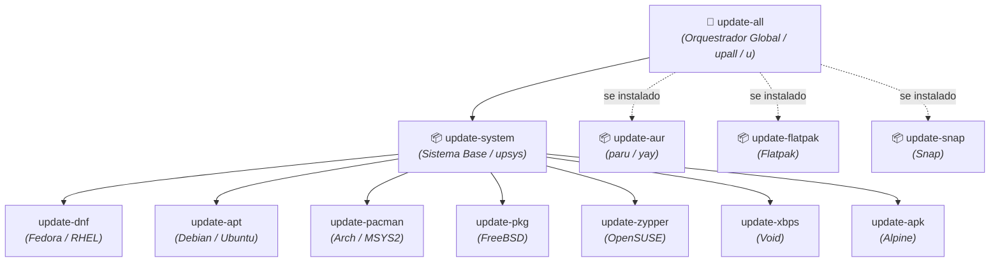

# 🗺️ Dicionário de Comandos Públicos, Aliases & Variáveis

O **Universal Shell Environment** adota uma convenção estrita de nomenclatura para garantir máxima previsibilidade e manter o autocompletion limpo:

- 🌐 **`kebab-case` (ou termo único) = Comandos Públicos:** Utilitários e atalhos desenhados para invocação interativa pelo usuário.
- 🔒 **`_snake_case` (prefixo `_`) = Helpers Privados:** Funções internas de bootstrapping e infraestrutura que não poluem o autocompletion.
- 🏛️ **`SNAKE_CASE` maiúsculo = Variáveis de Ambiente:** Configurações e caminhos canônicos exportados para a sessão.

---

## 1. ⚙️ Shell, Ambiente & Vault (Universais)

| Comando / Alias                       | Descrição                                                                                     | Compatibilidade       |
| :------------------------------------ | :-------------------------------------------------------------------------------------------- | :-------------------- |
| `update-shell` / `upsh`               | Sincroniza o repositório local do shell (`git pull`) e recarrega a sessão.                    | Universal             |
| `reinstall-shell` / `resh`            | Reexecuta o instalador `install.sh` preservando o contexto ativo (`desktop`, `server`, etc.). | Universal             |
| `update-vault` / `upvt`               | Sincroniza o repositório do cofre (`~/.vault`) e recarrega chaves e variáveis.                | Linux, FreeBSD, macOS |
| `bench-shell` / `bsh` / `shell-bench` | Mede a latência de inicialização dos shells (`sh`, `bash`, `zsh`) e módulos isolados.         | Universal             |
| `path-front <dir>`                    | Insere um diretório no início do `$PATH` (prioridade máxima).                                 | Universal             |
| `path-back <dir>`                     | Insere um diretório no fim do `$PATH` (prioridade mínima).                                    | Universal             |
| `path-dedup`                          | Remove diretórios duplicados do `$PATH` preservando a ordem original.                         | Universal             |

---

## 2. 📝 Editores de Texto & Terminal

| Comando Canônico / Alias                      | Descrição                                                                              | Editor Alvo                                                                                           |
| :-------------------------------------------- | :------------------------------------------------------------------------------------- | :---------------------------------------------------------------------------------------------------- |
| `editor [alvo]` / `e [alvo]`                  | Abre o editor padrão configurado (se sem argumentos, abre `.`).                        | `$VISUAL` / `$EDITOR` (com cascata Neovim > Helix > Micro > Kakoune > Nano > EE > MG > Vim > MC > VI) |
| `open-neovim` / `open-nvim` / `on [alvo]`     | Abre o Neovim no diretório ou arquivo especificado (padrão: `.`).                      | `nvim`                                                                                                |
| `open-vim` / `ov [alvo]`                      | Abre o Vim no diretório ou arquivo especificado (padrão: `.`).                         | `vim`                                                                                                 |
| `open-helix` / `open-hx` / `oh` / `h [alvo]`  | Abre o Helix no diretório ou arquivo especificado (padrão: `.`), restaurando o cursor. | `hx` (com wrapper defensivo de cursor)                                                                |
| `open-micro` / `om [alvo]`                    | Abre o Micro no diretório ou arquivo especificado (padrão: `.`).                       | `micro`                                                                                               |
| `open-code` / `oc [alvo]`                     | Abre o VS Code no diretório ou arquivo especificado (padrão: `.`).                     | `code` / `vscode`                                                                                     |
| `open-codium` / `ocm [alvo]`                  | Abre o VSCodium no diretório ou arquivo especificado (padrão: `.`).                    | `codium`                                                                                              |
| `open-antigravity` / `open-ant` / `oa [alvo]` | Abre o Antigravity IDE (padrão: `.`).                                                  | `antigravity-ide`                                                                                     |
| `open-zed` / `oz [alvo]`                      | Abre o Zed no diretório ou arquivo especificado (padrão: `.`).                         | `zed`                                                                                                 |
| `open-kate` / `ok [alvo]`                     | Abre o Kate em segundo plano (padrão: `.`).                                            | `kate`                                                                                                |
| `open-geany` / `og [alvo]`                    | Abre o Geany em segundo plano (padrão: `.`).                                           | `geany`                                                                                               |
| `emacs-start` / `es`                          | Inicia o daemon do Emacs em segundo plano.                                             | `emacs --daemon` / `runemacs`                                                                         |
| `emacs-kill` / `ek`                           | Encerra processos do Emacs em execução.                                                | `pkill emacs`                                                                                         |
| `emacs-restart` / `er`                        | Reinicia o daemon do Emacs (`emacs-kill && emacs-start`).                              | Emacs Daemon                                                                                          |
| `emacs-client` / `ec [args]`                  | Abre o cliente Emacs em uma nova janela (`emacsclient`).                               | `emacsclient` / `emacsclientw`                                                                        |
| `emacs-open` / `oe [alvo]`                    | Abre o Emacs GUI no diretório/arquivo atual em segundo plano.                          | `emacsclient` / `emacsclientw`                                                                        |

---

## 3. 📦 Atualização de Pacotes & Sistema Operacional

| Comando Canônico / Alias                    | Descrição                                                                | Escopo / Gerenciador          |
| :------------------------------------------ | :----------------------------------------------------------------------- | :---------------------------- |
| `update-all` / `upall` / `u`                | **Orquestrador Global:** Atualiza o sistema base + AUR + Flatpak + Snap. | Universal                     |
| `update-system` / `upsys`                   | Atualiza os pacotes do sistema base detectando a distribuição nativa.    | Universal                     |
| `update-aur` / `upaur` / `upyay` / `upparu` | Atualiza pacotes do Arch User Repository (prioriza `paru > yay`).        | Arch Linux                    |
| `update-pacman` / `upman`                   | Atualiza pacotes via Pacman.                                             | Arch Linux / Windows (MSYS2)  |
| `update-apt` / `upapt`                      | Atualiza repositórios e pacotes via APT.                                 | Debian, Ubuntu, Mint, Pop!_OS |
| `update-dnf` / `updnf`                      | Atualiza pacotes via DNF.                                                | Fedora, RHEL, Rocky, Alma     |
| `update-zypper` / `upzyp`                   | Atualiza pacotes via Zypper.                                             | openSUSE, SLES                |
| `update-xbps` / `upxbps`                    | Atualiza pacotes via XBPS.                                               | Void Linux                    |
| `update-apk` / `upapk`                      | Atualiza pacotes via APK.                                                | Alpine Linux                  |
| `update-pkg` / `uppkg`                      | Atualiza pacotes via PKG.                                                | FreeBSD                       |
| `update-flatpak` / `upflat`                 | Atualiza todos os Flatpaks instalados.                                   | Linux                         |
| `update-snap` / `upsnap`                    | Atualiza todos os Snaps instalados.                                      | Linux                         |

---

## 4. 🌐 Rede & Wi-Fi

| Comando Canônico / Alias   | Descrição                                                                 | Backend Nativo                                                           |
| :------------------------- | :------------------------------------------------------------------------ | :----------------------------------------------------------------------- |
| `update-wifi` / `upwf`     | Sincroniza credenciais de Wi-Fi (`WIFI_SSID_*` / `WIFI_PASS_*`) com o SO. | Linux (`nmcli`), FreeBSD (`wpa_supplicant`/`wifibox`), Windows (`netsh`) |
| `update-network` / `upnet` | Orquestrador de rede (executa `update-wifi` e valida conectividade).      | Universal                                                                |

---

## 5. ⚡ Controle de Energia

| Comando    | Descrição                                           | Ação Nativa                                                                              |
| :--------- | :-------------------------------------------------- | :--------------------------------------------------------------------------------------- |
| `poweroff` | Desliga o computador com segurança via `_as_root`.  | Linux (`shutdown -h now`), FreeBSD (`shutdown -p now`), Windows (`shutdown.exe /s /t 0`) |
| `reboot`   | Reinicia o computador com segurança via `_as_root`. | Linux/FreeBSD (`shutdown -r now`), Windows (`shutdown.exe /r /t 0`)                      |

---

## 6. 📱 Gestão de Dispositivos Móveis _(Contexto Desktop)_

| Comando / Alias                                | Descrição                                                             | Tecnologias Suportadas                                                                               |
| :--------------------------------------------- | :-------------------------------------------------------------------- | :--------------------------------------------------------------------------------------------------- |
| `mount-device` / `mntdev` / `mdev`             | Mapeia celular em `~/Device` em 4 estágios inteligentes.              | GNOME/XFCE MTP (`GVfs`), GSConnect, KDE Dolphin (`KIO-MTP`), KDE Connect (`KIO-FUSE`), ADB (`adbfs`) |
| `umount-device` / `umntdev` / `umdev` / `udev` | Desmonta `~/Device`, fecha túneis e remove o diretório com segurança. | `fusermount3`, `fusermount`, `umount`, KDE Connect CLI                                               |

---

## 7. ⚡ Utilitários Modernos, Atalhos & Navegação

| Comando / Alias                       | Descrição                                                  | Ferramenta Alvo & Fallback                                 |
| :------------------------------------ | :--------------------------------------------------------- | :--------------------------------------------------------- |
| `l`                                   | Listagem enxuta com ícones e agrupamento de diretórios.    | `eza` > `exa` > `ls` (usa `ls` nativo em TTY bruto)        |
| `ll`                                  | Listagem detalhada com metadados, permissões e status Git. | `eza -la --git` > `exa -la --git` > `ls -laF`              |
| `la`                                  | Listagem incluindo arquivos ocultos.                       | `eza -a` > `exa -a` > `ls -a`                              |
| `lt`                                  | Exibição da árvore de diretórios (_tree view_).            | `eza --tree` > `exa --tree` > `tree`                       |
| `g <termo>`                           | Busca rápida de texto em arquivos.                         | `rg --smart-case` > `grep -Ei`                             |
| `c <arquivo>` / `b`                   | Visualização formatada com destaque de sintaxe.            | `bat --paging=never` > `cat` (usa `cat` em TTY bruto)      |
| `f <nome>` / `ff`                     | Busca rápida de arquivos e diretórios.                     | `fd` / `fd --hidden --no-ignore` > `find`                  |
| `~`, `/`, `..`, `...`, `....`, `-- -` | Atalhos rápidos de navegação no sistema de arquivos.       | `cd ~`, `cd /`, `cd ..`, `cd ../..`, `cd ../../..`, `cd -` |

---

## 8. 🌳 Controle de Versão: Git & Game of Trees (Got/tog)

| Comando Canônico / Alias | Descrição                                                                          | Ferramenta Alvo / Comportamento              |
| :----------------------- | :--------------------------------------------------------------------------------- | :------------------------------------------- |
| `vcs-status` / `gs`      | Status inteligente e contextual: roda `got status` em Got ou `git status --short`. | Got (`.got/`) > Git (`.git/`)                |
| `vcs-diff` / `gd`        | Diff inteligente e contextual: roda `got diff` em Got ou `git diff`.               | Got (`.got/`) > Git (`.git/`)                |
| `got-init <url> <dir>`   | Helper de bootstrapping: clona repositório bare (`.git`) e extrai a work tree.     | Game of Trees (`got clone` + `got checkout`) |
| `tg` / `tog`             | Inicia o navegador interativo TUI do Game of Trees.                                | `tog`                                        |
| `tgl`                    | Abre o navegador de histórico e grafo de commits.                                  | `tog log`                                    |
| `tgd`                    | Abre o navegador interativo de diferenças (diff).                                  | `tog diff`                                   |
| `tgb <arquivo>`          | Abre a visualização interativa de anotações de autoria (_blame_).                  | `tog blame`                                  |
| `tgt`                    | Abre o navegador interativo da árvore de arquivos do repositório.                  | `tog tree`                                   |

---

## 9. 🌐 Variáveis de Ambiente & Configurações Globais

| Variável                           | Descrição / Propósito                                                        | Origem / Padrão                                                             |
| :--------------------------------- | :--------------------------------------------------------------------------- | :-------------------------------------------------------------------------- |
| `SHELL_REPO_DIR`                   | Caminho raiz do repositório clonado do Universal Shell.                      | `/usr/local/share/shell` (Linux/BSD) ou `~/.shell` (Windows)                |
| `SHELL_CONTEXT`                    | Contexto ativo carregado na sessão interativa.                               | `desktop` (padrão), `server`, `container`, `wsl`                            |
| `SHELL`                            | Caminho do executável do shell ativo.                                        | Auto-detectado dinamicamente (`bash`, `zsh`, `sh`)                          |
| `EDITOR` / `VISUAL`                | Editor de texto padrão do sistema.                                           | Preserva o do usuário ou define via cascata (`nvim > hx > micro > ...`)     |
| `FILEMANAGER`                      | Gerenciador de arquivos preferido para abrir pastas no desktop.              | Lido pelo `mount-device` (fallback para `dolphin`, `nautilus`, etc.)        |
| `COLORTERM`                        | Sinaliza suporte universal a 24-bit TrueColor RGB no terminal.               | Exportado globalmente como `truecolor`                                      |
| `MICRO_TRUECOLOR`                  | Ativa suporte a TrueColor no editor Micro.                                   | Exportado globalmente como `1`                                              |
| `GTK_THEME`                        | Tema visual aplicado a ferramentas GTK3/GTK4.                                | Auto-detectado (`Breeze-Dark`, `Adwaita:dark`, etc.) via XDG Portal / D-Bus |
| `QT_QPA_PLATFORMTHEME`             | Módulo de plataforma e diálogo de arquivos para aplicativos Qt.              | Auto-detectado (`xdgdesktopportal`, `gtk3`, `qt6ct`, `qt5ct`)               |
| `QT_STYLE_OVERRIDE`                | Motor de renderização de estilo para Qt.                                     | Auto-detectado (`Breeze-Dark`, `Breeze`)                                    |
| `ELECTRON_OZONE_PLATFORM_HINT`     | Ativa renderização nativa em Wayland para apps Electron.                     | Exportado globalmente como `auto`                                           |
| `_JAVA_AWT_WM_NONREPARENTING`      | Corrige janelas cinzas em apps Java/Swing em WMs tiling e Wayland.           | Exportado globalmente como `1`                                              |
| `EMACS_SOCKET_NAME`                | Caminho do socket de autenticação do daemon Emacs (Contexto Desktop).        | `${HOME}/.emacs.d/var/server/auth/server`                                   |
| `HISTSIZE` / `HISTFILE`            | Limite e arquivo de histórico persistente no POSIX `sh`.                     | `10000` comandos em `${HOME}/.sh_history`                                   |
| `WIFI_SSID_*` / `WIFI_PASS_*`      | Credenciais Wi-Fi lidas e sincronizadas pelo `update-wifi`/`update-network`. | Injetadas pelo `Vault` ou variáveis de ambiente                             |
| `FRIGO_SERVER_*` / `ORBS_SERVER_*` | Chaves SSH e endereços IP de servidores remotos.                             | Injetados pelo `Vault`                                                      |
