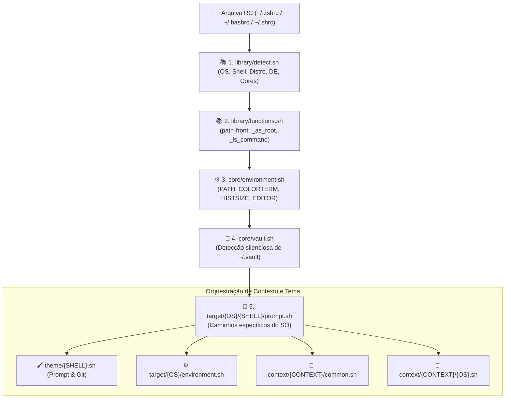

# 🏛️ Arquitetura & Ciclo de Vida do Universal Shell

O **Universal Shell Environment** é o motor de execução interativo do [Quarteto de Produtividade](https://github.com/GabrielFrigo4/setup). Ele foi concebido para entregar uma experiência de terminal idêntica e de alta velocidade em qualquer sistema operacional (**Linux**, **FreeBSD**, **macOS**, **Windows**).

---

## ⚡ Cascata de Inicialização (Boot Pipeline)

Ao abrir qualquer novo emulador de terminal, painel de multiplexador (`tmux`) ou conexão SSH, o arquivo de inicialização do shell (`.zshrc`, `.bashrc` ou `.shrc`) invoca o entrypoint modular do ecossistema:

### Ordem Estrita de Sourcing:

1. **`library/detect.sh`**: Executa sondagens em baixo nível para identificar o sistema hospedeiro sem gerar subprocessos desnecessários.
2. **`library/functions.sh`**: Exporta helpers universais (`path-front`, `path-back`, `_as_root`, `_is_command`) requeridos por todos os módulos subsequentes.
3. **`core/environment.sh`**: Define variáveis canônicas, sanitiza o `$PATH`, ativa suporte a TrueColor (24-bit RGB) e configura históricos persistentes.
4. **`core/vault.sh`**: Se o diretório `~/.vault` existir, injeta silenciosamente variáveis de ambiente privadas e chaves SSH.
5. **`target/{OS}/{SHELL}/prompt.sh`**: Carrega as customizações específicas da plataforma e compõe o tema visual.
6. **`context/{CONTEXT}/`**: Aplica atalhos e comportamentos específicos da carga de trabalho (`desktop`, `server`, `container` — com extensões WSL automáticas).

---

## ⏱️ Orçamento de Desempenho (<64ms, padrão $2^n$)

A regra máxima do Universal Shell é a **latência imperceptível** governada pelo padrão binário de potências de 2 ($2^n$). Nenhuma sessão deve demorar mais de 64 milissegundos (alvo `PASS`, com meta `ULTRA < 32ms`) para renderizar o primeiro prompt:

- **Zero Forks Excessivos:** Evita pipes pesados (`grep | awk | sed | cut`) durante o boot; utiliza expansões de parâmetro POSIX nativas sempre que possível.
- **Lazy Loading Estratégico:** Utilitários de terceiros pesados (como `sdkman`, `nvm` ou `pyenv`) não são carregados no boot da sessão, mas envelopados sob demanda.
- **Detecção em Cache de Memória:** Checagens de ambiente são mantidas no escopo da sessão, evitando leituras de disco redundantes.

---

## 🤫 A Regra do Silêncio (_Rule of Silence_)

Em conformidade com a filosofia UNIX:

> _"Um programa deve produzir apenas as saídas estritamente necessárias. Silêncio é ouro."_

- **Zero Banners / Zero Textos:** O terminal não exibe ASCII art, mensagens de boas-vindas, logs de inicialização ou contadores de pacotes ao abrir.
- **Suporte Perfeito a Ferramentas Remotas:** O silêncio absoluto no boot garante que ferramentas como `scp`, `sftp`, `rsync`, `ansible` e `git` operem sem falhas ou corrupção de fluxo de dados.

---

## 🛡️ Portabilidade POSIX vs. Shells Modernos

- **Camadas Base (`library/`, `core/`):** Escritas em estrita conformidade com o padrão **POSIX sh**. Devem rodar no `/bin/sh` nativo do FreeBSD sem nenhuma dependência de extensões do GNU Bash.
- **Prompts Especializados (`theme/`):**
    - **Zsh (`theme/zsh.sh`):** Utiliza o subsistema `zstyle`, `vcs_info` e autocompletion com menu interativo.
    - **Bash (`theme/bash.sh`):** Utiliza escape sequences nativas do Bash com suporte a cores 256/TrueColor e status Git.
    - **POSIX Sh (`theme/sh.sh`):** Prompt atômico, leve e sem dependências, exclusivo para o FreeBSD `/bin/sh`.
    - **KornShell (`theme/ksh.sh`):** Prompt ultra-leve calibrado para `/bin/ksh` no OpenBSD com controle defensivo `\001` e ANSI nativo.
